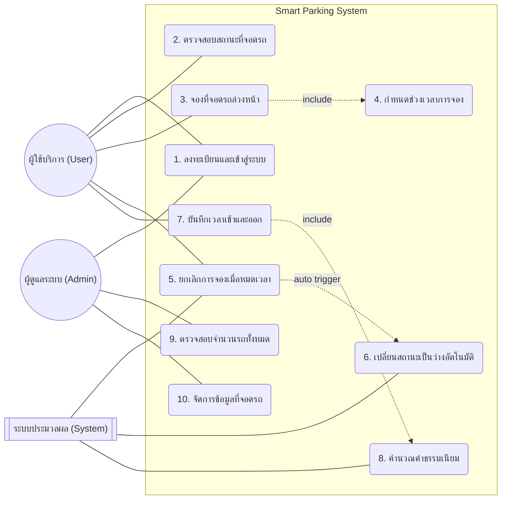

# Requirement document
## Functioal requirement
### 1.ระบบต้องสามารถให้ผู้ใช้ลงทะเบียนและเข้าสู่ระบบได้
### 2.ระบบต้องสามารถแสดงจำนวนที่จอดรถว่างและไม่ว่างให้ผู้ใช้ตรวจสอบได้
### 3.ระบบต้องสามารถให้ผู้ใช้จองที่จอดรถล่วงหน้าได้
### 4.ระบบต้องสามารถกำหนดช่วงเวลาในการจองที่จอดรถได้
### 5.ระบบต้องสามารถยกเลิกการจองที่จอดรถได้เมื่อหมดเวลาการจอง 
### 6.ระบบต้องเปลี่ยนสถานะที่จอดรถเป็นว่างโดยอัตโนมัติ
### 7.ระบบต้องสามารถบันทึกเวลาเข้าและออกของรถแต่ละคันได้
### 8.ระบบต้องสามารถคำนวณค่าธรรมเนียมการจอดรถตามระยะเวลาได้
### 9.ระบบต้องสามารถตรวจสอบจำนวนรถที่จอดอยู่ภายในที่จอดรถทั้งหมดได้
### 10.ระบบต้องสามารถให้ผู้ดูแลห้างเพิ่ม แก้ไข และจัดการข้อมูลที่จอดรถได้

## Non-Functional Requirements
### 1. ระบบต้องสามารถตอบสนองต่อการค้นหาที่จอดรถภายในเวลาไม่เกิน 3 วินาที
### 2. ระบบต้องมีการยืนยันตัวตนก่อนเข้าใช้งาน
### 3. ระบบต้องมีการสำรองข้อมูลเพื่อป้องกันข้อมูลสูญหาย
### 4. ระบบต้องมีหน้าตาแอพพลิเคชันที่ใช้งานง่ายและเข้าใจได้
### 5. ระบบต้องสามารถรองรับการเพิ่มจำนวนห้างสรรพสินค้าได้ในอนาคต

# ข้อกำหนดคุณสมบัติระบบบริหารจัดการที่จอดรถอัจฉริยะ
## 1. ระบบแสดงผลสำหรับผู้ใช้บริการ (Front-End) ผ่าน Web และ Mobile Application
### 1.1 ปรับปรุง User Interface ให้มีความสมัยใช้งานง่าย รองรับการใช้งานแบบ Responsive Design ทั้งบน Web Browser และ Mobile Application (iOS และ Android) 
### 1.2 มีฟังก์ชันสำหรับการ Log in เข้าสู่ระบบ และมีระบบช่วยเหลือกรณีลืมรหัสผ่าน เพื่อความปลอดภัยในการเข้าถึงข้อมูลส่วนตัว 
### 1.3 มีหน้าเว็บและหน้าแอปพลิเคชันสำหรับแสดงรายการที่จอดรถ โดยสามารถแสดง สถานะว่าง/ไม่ว่าง ของพื้นที่จอดรถทั้งหมดได้แบบ Real-time 
### 1.4 มีหน้าสำหรับแสดง Profile ของ User ซึ่งผู้ใช้สามารถปรับเปลี่ยนข้อมูลส่วนตัวและตรวจสอบประวัติการใช้งานได้

## 2. ระบบการจองและบริหารจัดการสถานะที่จอดรถ
### 2.1 ระบบการจองล่วงหน้า: ผู้ใช้สามารถทำการเลือกพื้นที่จอดรถและจองล่วงหน้าผ่านระบบได้ 
### 2.2 ระบบกำหนดเวลา: สามารถระบุช่วงเวลาเริ่มต้นและสิ้นสุดในการเข้าจอดได้ตามความต้องการ 
### 2.3 ระบบยกเลิกอัตโนมัติ: เมื่อหมดเวลาการจองแล้วผู้ใช้ไม่เข้าจอด ระบบต้องสามารถทำการยกเลิกการจองได้ทันที 
### 2.4 ระบบปรับปรุงสถานะอัตโนมัติ: เมื่อมีการยกเลิกการจองหรือรถออกจากพื้นที่ ระบบต้องเปลี่ยนสถานะที่จอดรถเป็น "ว่าง" โดยอัตโนมัติเพื่อรองรับผู้ใช้รายถัดไป

## 3. ระบบบันทึกข้อมูลและคำนวณค่าธรรมเนียม
### 3.1 ระบบบันทึกเวลา: สามารถบันทึกเวลาเข้า (Check-in) และเวลาออก (Check-out) ของรถแต่ละคันได้อย่างแม่นยำ 
### 3.2 ระบบคำนวณค่าธรรมเนียม: มีฟังก์ชันการคำนวณค่าบริการจอดรถอัตโนมัติตามระยะเวลาที่ใช้งานจริง โดยอิงตามฐานข้อมูลอัตราค่าบริการที่กำหนดไว้

## 4. ระบบการจัดการสำหรับผู้ดูแลระบบ (Back-End)
### 4.1 ระบบจัดการที่จอดรถ (Parking Management): ผู้ดูแลระบบสามารถ เพิ่ม ลด แก้ไข และจัดการข้อมูลพื้นที่จอดรถ รวมถึงสถานะการให้บริการได้ 
### 4.2 ระบบจัดการสมาชิก (User Management): สามารถตรวจสอบ ดูข้อมูลพื้นฐาน จัดบทบาท (Role) และกลุ่มของผู้ใช้งานได้ 
### 4.3 ระบบสถิติและรายงาน (Report & Dashboard):

#### 4.3.1 รายงานสรุปเชิงกราฟิก (Dashboard): แสดงจำนวนรถที่จอดอยู่ทั้งหมด, ยอดรวมค่าธรรมเนียม และช่วงเวลาที่มีการใช้งานสูงสุด (รายวัน/รายเดือน/รายปี)

#### 4.3.2 รายงานเชิงตาราง: สามารถ Export เป็นไฟล์ Excel ได้ เช่น รายงานประวัติการเข้า-ออก และรายงานรายได้แยกตามประเภทผู้ใช้

## 5. คุณสมบัติด้านประสิทธิภาพและเทคนิค 
### 5.1 ประสิทธิภาพ (Performance): ระบบต้องสามารถตอบสนองต่อการสืบค้นสถานะที่จอดรถได้ภายในเวลาไม่เกิน 3 วินาที 
### 5.2 ความปลอดภัย (Security): มีระบบการยืนยันตัวตน (Authentication) ก่อนเข้าใช้งาน และมีการสำรองข้อมูล (Backup) สม่ำเสมอเพื่อป้องกันข้อมูลสูญหาย 
### 5.3 การขยายตัว (Scalability): โครงสร้างระบบต้องรองรับการเพิ่มจำนวนพื้นที่จอดรถ หรือการเชื่อมต่อกับห้างสรรพสินค้าสาขาอื่นๆ ได้ในอนาคต

## 6. คุณสมบัติผู้เสนอราคา 
### 6.1 ผู้เสนอราคาต้องไม่เป็นผู้ที่ถูกระบุชื่อไว้ในบัญชีรายชื่อผู้ทิ้งงานของทางราชการ 
### 6.2 ผู้เสนอราคาต้องมีหนังสือแต่งตั้งตัวแทนจำหน่ายหรือสิทธิ์ในการจัดจำหน่ายหากไม่ได้เป็นเจ้าของผลิตภัณฑ์โดยตรง 
### 6.3 ซอฟต์แวร์ที่นำเสนอต้องเคยถูกติดตั้งและใช้งานภายในองค์กรภาครัฐหรือเอกชนมาแล้ว เพื่อสร้างความเชื่อมั่นในเสถียรภาพของระบบ

